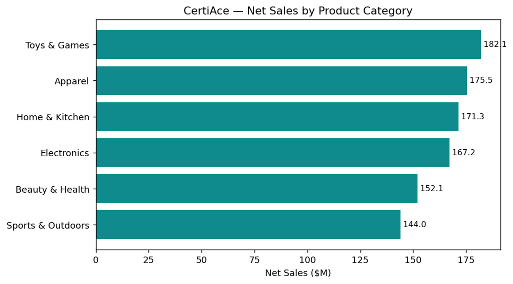
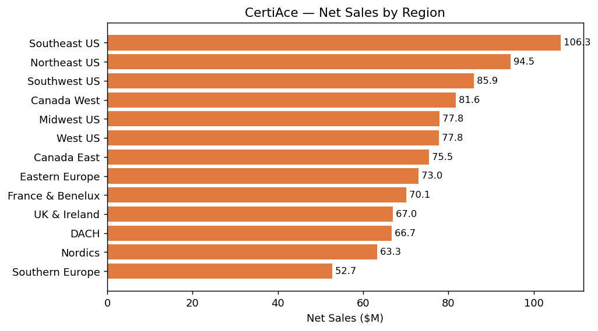
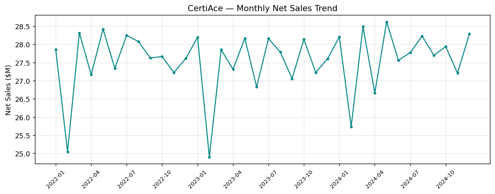

# Medallion pipeline — Fabric & local

Two implementations of the same **Bronze → Silver → Gold** logic over the CertiAce
retail dataset (500K sales rows across store, product, and date dimensions).

| Script | Runtime | What it does |
|---|---|---|
| [`medallion_fabric.py`](medallion_fabric.py) | Microsoft Fabric notebook (PySpark) | Ingests the CSVs from this repo's raw GitHub URLs, writes Delta tables `bronze_*`, `silver_*`, `gold_sales_enriched`, `gold_sales_by_category_region` to the attached Lakehouse. |
| [`medallion_local.py`](medallion_local.py) | Any machine (pandas, no Spark) | Same logic against `../data`, writes Gold outputs to `../output`. |
| [`make_charts.py`](make_charts.py) | Any machine (matplotlib) | Renders portfolio charts from the Gold layer to `../docs/images`. |

## Run in Fabric
1. Create a Lakehouse, open a new notebook, and attach the Lakehouse as default.
2. Paste `medallion_fabric.py` into a cell and **Run all**. Tables appear under the Lakehouse.

## Run locally
```bash
pip install pandas pyarrow matplotlib
python notebooks/medallion_local.py   # builds ../output/gold_*
python notebooks/make_charts.py       # builds ../docs/images/*.png
```

## Gold layer

**`gold_sales_enriched`** — one denormalized fact row per sale, joined to date,
store, and product attributes (analytics-ready, Direct Lake friendly).

**`gold_sales_by_category_region`** — net sales, gross margin, and quantity
aggregated by product category × region.




